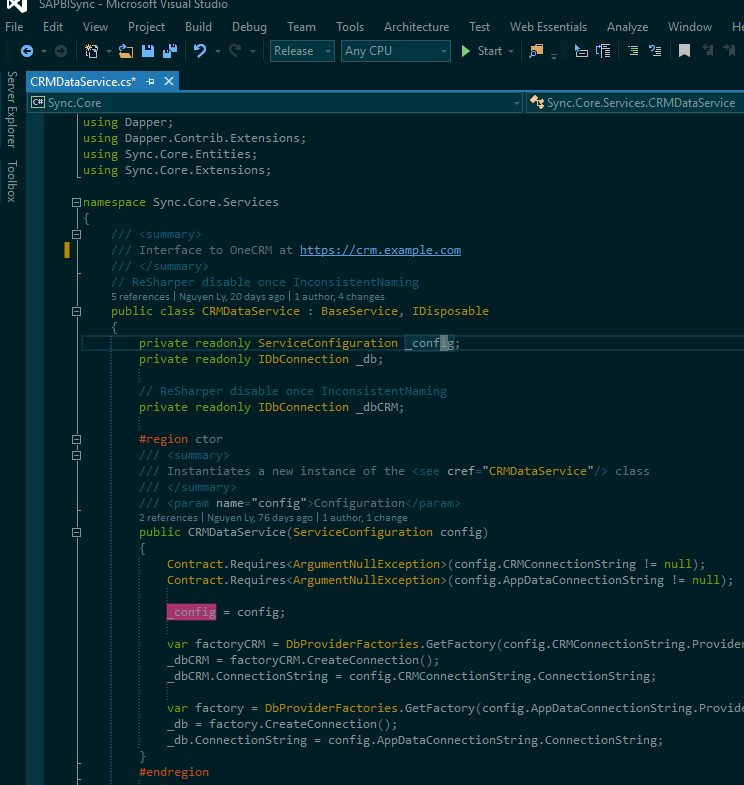
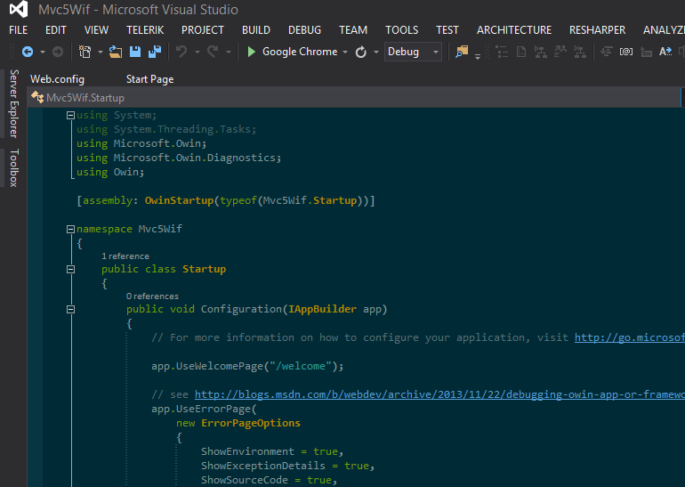
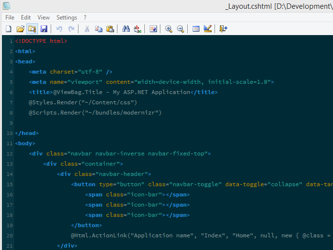
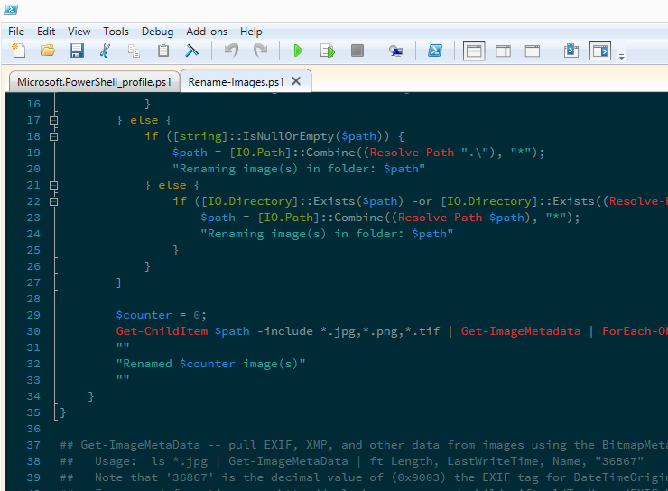

# Solarized Color Schemes

This repo holds settings for various editors customised with the dark [Solarized](http://ethanschoonover.com/solarized) colour scheme.

## Visual Studio 2015

Use the [Visual Studio 2015 Color Theme Editor extension](https://visualstudiogallery.msdn.microsoft.com/6f4b51b6-5c6b-4a81-9cb5-f2daa560430b), import the `VS2015.vstheme` file.

This extends the in-built dark solarized theme from the extension with many fixes and settings that have been omitted including the
following:

- Fix operator settings (from incorrect black setting to same as text)
- Types set to yellow instead of orange
- XML Doc comments settings
- Pre-processor directives set to orange
- Highlighted reference - magenta
- Some [VsVim](https://visualstudiogallery.msdn.microsoft.com/59ca71b3-a4a3-46ca-8fe1-0e90e3f79329) settings to match overall theme

## Visual Studio 2013

`Tools -> Import and Export Settings -> Import selected environment settings` using the `VS2013.vssettings` file.

## Notepad2

To load settings: View -> Customize Schemes -> Import

## Powershell ISE (v4+ in Windows 8.1 & Windows 10)

Either use Tools -> Options -> Manage Themes -> Import

or source the `Theme-Solarized.ps1` script from the Console window:

    D:\dev\solarized>. Theme-Solarized.ps1

